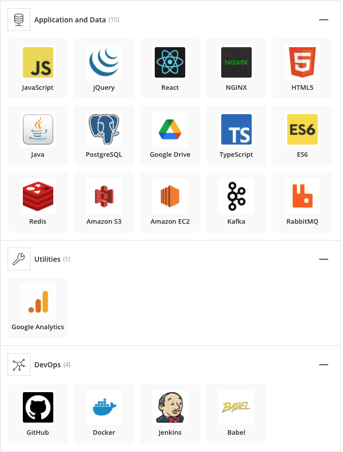

# Fintech Case Study
## Overview and Origin

### Name of company
 
Ripple Labs
 

### When was the company incorporated?
 

Ripple was founded in 2012
 

### Who are the founders of the company?
 

Ripple Labs was founded by Chris Larsen and Jeb McCaleb. The idea of the project "Ripple" or "XRP" is to modernize the institutional payments industry by "unlocking the power of blockchain" (Ripple.com, 2021). The company was funded through venture capitist investment. They have received over 293.8 million dollars (Crunchbase, 2021).
 

## Business Activities:
 

Founded in 2012 with the introduction of Blockchain technology, Ripple Lab's aim is to tackle the institutional payments industry and replace older technologies such as swift with a faster, decentrilized network. this network called RippleX or "XRP" is a cryptocurrency/blockchain network that offers developers and others to ability build faster and cheaper applications that focus on B2B global payments. The main focus for B2B payments is cost, speed and security. 
 

Ripple Lab's main customer base is financial institutions, examples of these in Canada would be Canadian Imperial Bank of Commerce, TD Bank, and Royal Bank of Canada. It is estimated that roughly $120 trillion per year globally with $25 trillion per year domestically (Goldenberg, 2020) is exchanged in B2B payments. This generates a market size of approximatly US $732.4 billion in 2019 (PMI, 2019) with an expect compounding annual growth of 10.1%. because these metrics are pre pandemic it is beleived that this value is closer to a trillion dollar industry. Currently there is one company that has majority control of this industry. Glodenberg notes that this a underpentrated market, with accelerating digital adoption this market is ripe for exponetial growth(Goldenberg, 2020).

 

Ripple core competency is Blockchain technology. They specifically implemented the Ripple Potocal Concensus Algorithm (RPCA) which is the main authenticator for the Ripple network. They deployed Two main applications to this network. Xrapid, a global payments application that leverages XRP as a bridge between two accounts.  the premise of Xrapid or on demand liquidity is the elimination of pre-funding destination accounts allowing banks to utilize more of their capital. The second application is Xcurrent which is an enterprise solution for fulfilling instant settlements and tracking. Xcurrent is built on a different protocal from the other applications. This technology is Interledger Protocol. Xcurrent is made up of four functionalities Messaging, Validation, Interledger Protocol, and Fx rates. These functionalities allow members to exchange information and details about transactions to each other, utilize a network of their own or third party validators to confrim the success or failure of a transaction, store and update a decentrelized ledge containg the debts, credits and liquity of each member, and understand the rates for exchanging currencies. Along with these technologies Ripple Lab's also utilizes a diverse collection of Devops, data and business tools to manage their service. I have added images from Stackshare to highlight them.

## Landscape:

* What domain of the financial industry is the company in?

* What have been the major trends and innovations of this domain over the last 5-10 years?

* What are the other major companies in this domain?

## Results

* What has been the business impact of this company so far?

* What are some of the core metrics that companies in this domain use to measure success? How is your company performing, based on these metrics?

* How is your company performing relative to competitors in the same domain?

## Recommendations

* If you were to advise the company, what products or services would you suggest they offer? (This could be something that a competitor offers, or use your imagination!)

* Why do you think that offering this product or service would benefit the company?

* What technologies would this additional product or service utilize?

* Why are these technologies appropriate for your solution?
